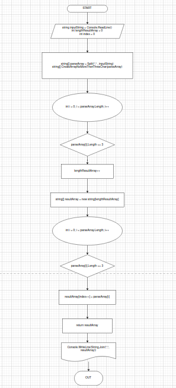
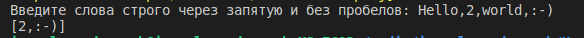
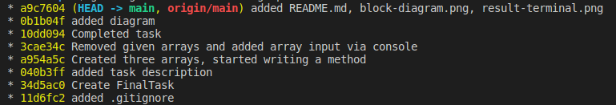

# Итоговая проверочная работа(1 четверть)

## Задача:

    Написать программу, которая из имеющегося массива строк формирует новый массив из строк,
    длина которых меньше, либо равна 3 символам.
    Первоначальный массив можно ввести с клавиатуры, либо задать на старте выполнения алгоритма.
    При решении не рекомендуется пользоваться коллекциями, лучше обойтись исключительно массивами.

    Примеры массивов:

        1. [“Hello”, “2”, “world”, “:-)”] → [“2”, “:-)”]
        2. [“1234”, “1567”, “-2”, “computer science”] → [“-2”]
        3. [“Russia”, “Denmark”, “Kazan”] → []


## Содержание проекта:
    1. Блок-схема алгоритма
    2. Файл README.md
    3. Исходный код программы

## Блок схема
> 

## Решение задачи: 
    1. Пользователь вводит строки через запятую, всё сохраняется в одну строку.

    2. Разделяем строку на элементы с помощью метода Split(), сепаратором является ",".

    3. Создаем массив с результирующими элементами.

    4. Создаем метод CreateArrayNoMoreThenThreeChar(string[] inputArray). Метод выбирает элементы которые содержат не более 3 символов, затем эти элементы складывает в новый результирующий массив и возвращает нам его.

    5. Методом PrintArray(string[] arr) вывод содержимое результирующего массива на экран

## Код программы
```
void PrintArray(string[] arr) {
	System.Console.WriteLine("[" + string.Join(",", arr) + "]");
}


string[] CreateArrayNoMoreThenThreeChar(string[] inputArray){

    int lengthResultArray = 0;
    int index = 0;
    
    
    for (int i = 0; i < inputArray.Length; i++) {
        if(inputArray[i].Length <= 3) {
            lengthResultArray++;
        }
    }

    
    string[] resultArray = new string[lengthResultArray];
    for (int i = 0; i < inputArray.Length; i++) {
        if(inputArray[i].Length <= 3) {
            resultArray[index++] = inputArray[i];
            
        }
    }
    return resultArray;
}

System.Console.Write("Введите слова строго через запятую и без пробелов: ");

string? inputString = System.Console.ReadLine();
string[] parseArray = inputString.Split(",");

string[] result = CreateArrayNoMoreThenThreeChar(parseArray);
PrintArray(result);

```
## Результат ввода и вывода в терминал
> 

## Скриншоты коммитов
> 